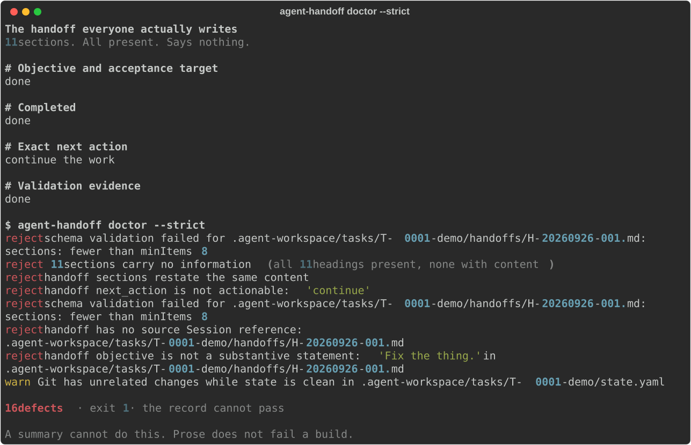

# agent-handoff

**Your coding agent forgets everything between sessions. This makes that a test failure instead of a mystery.**

You are 4 hours into a refactor. Context is full. You start a new session to
finish it. The agent re-reads the code, "discovers" a decision you already made
two hours ago, and undoes your work. You find out 40 minutes later.

Everyone's fix is the same: *write a summary.* A summary cannot be validated. It
drifts. It silently becomes the only copy of a commit hash. Nothing catches it.

`agent-handoff` replaces the summary with a **typed, schema-checked handoff
document** that a validator rejects if it is hollow — and a `doctor` command that
tells you when a session's story no longer matches your git history.

Works with **Claude Code, Cursor, Codex, Cline, OpenCode, or any agent that can
run a shell command.** No harness. No daemon. No API key. Python 3 only.

---

## Install

```sh
git clone https://github.com/faresrafat3/agent-handoff
cd agent-handoff
./install.sh
```

Or use it without installing:

```sh
python3 bin/agent-handoff init        # create .agent-workspace/ in your project
python3 bin/agent-handoff doctor --strict
```

No dependencies. Nothing runs in the background. It only writes inside your
project.

---

## What it looks like

Real output from `doctor --strict` on a handoff with all eleven sections
present, no content under any of them, and `continue the work` as the next
action. Regenerated from the tool by `demo/render_demo.py` — the image cannot
drift from the code.



## The problem, concretely

Three ways long agent sessions break. All three are silent.

**1. The confident non-action.** The agent writes:

```markdown
## Exact next action
Continue the work.
```

That is not an action. It names no file, no command, no test. A fresh session
receives it, has nothing to do, and starts guessing. `agent-handoff` rejects it:

```
$ agent-handoff doctor --strict
"Exact next action" is not actionable: it names no path, command, id, or verification step
```

**2. The hollow section.** Eleven headings, all present, all empty. It passes
every markdown linter ever written, and it tells the next session nothing.
`agent-handoff` rejects any section under 24 characters of substance, and
rejects two sections that are just restatements of each other.

**3. The stale claim.** The handoff says `git_head: a1b2c3d` and
`tree_state: clean`. You then commit `d4e5f6` with uncommitted changes. Now the
handoff is a lie and nothing knows. `agent-handoff doctor` re-reads git and
tells you the record is stale — because the claim is checkable, it is checked.

---

## What you get

| | |
|---|---|
| `agent-handoff init` | scaffolds `.agent-workspace/` — tasks, decisions, research, schemas |
| `agent-handoff doctor --strict` | **read-only** integrity report. 0 exit on clean, non-zero on any problem |
| `agent-handoff status` | what state every task is in |
| `agent-handoff context <T-0001>` | builds a **bounded, redacted, hash-stamped** context pack for a fresh session |
| `agent-handoff adopt` | **read-only scan of the markdown notes you already have** — finds the hollow sections, vague next actions, dead commits, and leaked credentials in your existing pile |
| `agent-handoff conformance` | runs the **published conformance suite** against this implementation — the standard, not a test of this tool |
| `agent-handoff close <T-0001> --dry-run` | the checks to run *before* you call a task done |
| `skills/handoff/SKILL.md` | drop into Claude Code / Cursor / any agent so it writes conforming handoffs on its own |

The agent-facing workflow:

```text
/hand-off                      # agent writes a validated handoff, refuses to seal a hollow one
agent-handoff context T-0001   # you paste the generated pack into a fresh session
```

---

## Why the pack is not just a summary

`agent-handoff context` emits a **projection**, not a transcript:

- **Bounded** — a hard aggregate byte ceiling; overflow is marked `[TRUNCATED]`, never silently dropped.
- **Redacted** — API keys, tokens, and passwords are stripped before emission (`SECRET_RE`).
- **Stamped** — every record carries `source_sha256` *and* `emitted_sha256`, so you can prove the pack wasn't edited.
- **Untrusted** — every record is wrapped in `<untrusted-record>` so the reading agent treats it as evidence, not instruction. This blocks prompt injection through your own notes.
- **Escaped-path proof** — symlinked and `../` context paths are refused.

---

## It is tested, and the tests are the point

```sh
$ python3 -m unittest discover -s tests
Ran 81 tests
OK
```

Several guards are **mutation-tested**: delete one and the suite fails. That is
checked, not claimed — including four guards the suite originally failed to
notice, which were found and fixed rather than left as decoration.

Every gate here exists because an earlier version was caught accepting a bad
record. The empty-section check, the vague-next-action check, and the
independent-sections check were each added in response to a real hollow handoff
getting through.

---

## The conformance suite is the standard, not a test of this tool

```sh
$ agent-handoff conformance
  ok   C01-hollow-section-rejected              expect=reject  actual=reject
  ok   C02-vague-next-action-rejected           expect=reject  actual=reject
  ...
  ok   C10-substantive-record-accepted          expect=accept  actual=accept

  10/10 — CONFORMS
  verifier independent of the claimant: yes | model calls in any gate: 0
```

Ten cases, fixed in this file, each stating why it exists. Half require a
**rejection** and half require an **acceptance**, because a suite of only
rejections cannot tell a real gate from a blunt refusal.

**Implement a different handoff format? Run this suite against your own output
and say so.** The cases are the published definition of "a handoff is good" —
they are not tuned to this implementation, and `doctor` cannot be changed to make
a failing case pass, because the cases are the thing being tested.

This already earned its keep: **case C08 failed against the reference
implementation**, because `doctor` had no gate refusing a credential inside a
record. `context` redacted secrets on the way out, which meant the key was still
sitting in the file, in git, and in every clone. The suite found the hole; the
gate is now `doctor`'s (G24).

## Is your setup actually verifiable? Check in 30 seconds.

```sh
python3 bin/agent-handoff adopt      # read-only, writes nothing, no model
```

```
findings_by_kind: { hollow-section: 22, vague-next-action: 9,
                    unknown-commit: 4, secret-pattern: 2 }
```

**If it reports zero findings, you do not need anything I sell** — that is a
common outcome and the correct answer for a lot of teams.

If it reports findings, that number is a real measurement of how much of what
you are relying on is not true right now. Most teams clear most of it in an
afternoon without adopting anything.

Full breakdown, and what a paid fix costs: [`docs/AUDIT.md`](docs/AUDIT.md).

## Already have a pile of notes? Start here.

Most people who hit this problem already have 400 lines of hand-maintained
markdown and no way to tell which half of it is still true. `adopt` reads them
and tells you. It **never writes, moves, or deletes anything.**

```sh
$ agent-handoff adopt
{
  "ok": true,
  "read_only": true,
  "scanned": 214,
  "with_findings": 37,
  "findings_by_kind": {
    "hollow-section": 22,
    "vague-next-action": 9,
    "unknown-commit": 4,
    "secret-pattern": 2
  },
  ...
}
```

Every finding carries a `fix`. Then decide whether you want the standard at all —
some people are better off with a wiki, and the report says which kind of pile
you have. Non-zero exit when something is wrong, so it works in CI.

## See it work

```sh
./demo/demo.sh
```

A deterministic terminal demo: it writes the hollow handoff everyone actually
writes, shows the doctor rejecting all sixteen ways it fails, supersedes it with
a real one, and builds the context pack. Every claim the demo prints is asserted
in the script — if the tool's behaviour changes, the demo fails rather than
lying. No network, no API key, same output every run.

## Gate it in CI

```yaml
- uses: faresrafat3/agent-handoff@v1
  with:
    mode: doctor        # or `adopt` to scan notes you already have
    strict: 'true'
```

A handoff that goes stale then fails the build instead of misleading the next
session until a human notices. Full example in
[`examples/ci-consumer.yml`](examples/ci-consumer.yml).

Without CI, any convention decays into decoration. That is not a criticism of
anyone using markdown — it is a property of conventions.

## The standard is published separately from this tool

[`docs/SPEC.md`](docs/SPEC.md) is normative and written so that an
implementation in any language can conform **without reading this source**. The
conformance cases are fixed in [`bin/agent-handoff`](bin/agent-handoff) and each
states why it exists.

Building a different handoff format? Run the suite against your own output:

```sh
agent-handoff conformance
  10/10 — CONFORMS
```

The point of a standard is that people conform to it without asking.

## Honest limits

- It does **not** run your agent, schedule anything, or checkpoint a workflow. For durable execution use LangGraph, Temporal, OpenAI Agents SDK, or Google ADK. This sits one layer above them.
- It does **not** have semantic memory. It does not decide what is worth remembering.
- Archiving and task recycling stay **manual**. Five real gates are still `DEFERRED` and are listed in [`docs/acceptance-matrix.md`](docs/acceptance-matrix.md) rather than quietly marked done.
- The doctor is conservative by design: it reports, it never auto-fixes or deletes your data.

I'd rather ship five honest gates than twenty-five that don't hold.

---

## Why this exists

Built after losing real work to real context rot, then hardened against a
multi-agent research setup where a bad handoff silently corrupted a study. The
methodology — *records over claims, verify before claiming, generated counts
never hand counts* — is documented in [`docs/STANDARD.md`](docs/STANDARD.md).

## Contributing

See [`CONTRIBUTING.md`](CONTRIBUTING.md). Gates are the contract; a change that
weakens a gate needs a failing test first.

## License

MIT
